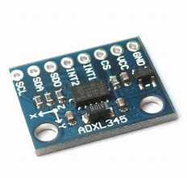

# ADXL345
ADXL345 Triple Axis Accelerometer driver for TiJOS

| 条目         | 说明                          |
| ---------- | --------------------------- |
| 驱动名称       | ADXL345 3轴、±2 G/±4 G/±8 G/±16 G数字加速度计           |
| 适用         | 该驱动适用于ADXL345系列数字加速度计        |
| 通讯方式       | I2C                         |
| Java Class | TiADXL345.java               |
| 图片         |  |

